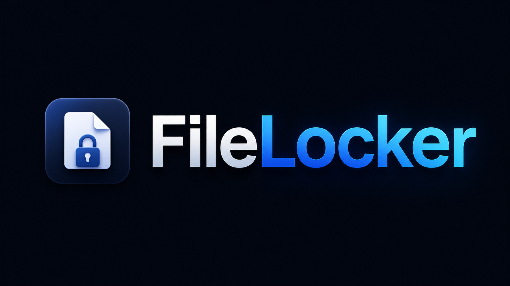

<p align="center">
  
</p>

# FileLocker

**FileLocker** is a Windows desktop app for encrypting, decrypting, validating, and managing local files with a clean WinUI 3 interface.

It is built for people who want a practical encryption tool that feels approachable without hiding the important safety controls.

Current app version: **1.0.4.0**

## Highlights

- Modern WinUI 3 desktop app for Windows 10/11
- Drag-and-drop queue for files and folders
- AES-GCM and AES-CBC encryption modes
- Built-in profiles for safer defaults
- Optional keyfile support
- Verification, backup, and cleanup controls
- Markdown and CSV report export
- NSIS installer distribution
- Automatic update checks through GitHub Releases

## Core Features

### Encryption and decryption

- Encrypt files with **AES-GCM** or **AES-CBC**
- Decrypt FileLocker payloads back to their original file names and extensions
- Optional compression before encryption
- Optional filename scrambling
- Optional PNG container mode for less obvious encrypted output

### Safety and recovery

- Temporary-file write flow to reduce partial-write risk
- Optional post-write verification
- Optional backup copy creation before destructive actions
- Optional original-file removal after success
- Optional secure delete when removing originals

### Profiles and key material

- Built-in security profiles
- Save reusable custom profiles
- Optional **keyfile** support in addition to password-based encryption
- Password strength feedback in the UI

### Queue and reporting

- Drag-and-drop queue
- Recursive folder handling
- Duplicate skipping
- Preflight checks with warning and blocking states
- Recent job history
- Markdown and CSV report export

## Built-In Profiles

| Profile | Purpose |
| --- | --- |
| `Recommended` | Balanced default with AES-GCM, verification, and non-destructive behavior |
| `Private Archive` | Better privacy defaults with scrambled names and randomized metadata |
| `Fast Local Lock` | Faster local protection with compression disabled |
| `Transfer Copy` | Verified encrypted output with source removal after success |
| `Shred After Lock` | Aggressive cleanup path with secure delete after success |
| `Stealth PNG` | Wraps encrypted output in a PNG container |

## Security Notes

FileLocker currently uses:

- **AES-GCM**
- **AES-CBC**
- **PBKDF2-SHA256** for key derivation

Some older internal naming still references Argon2 from earlier experiments, but the current implementation is **PBKDF2-SHA256**.

## Requirements

### End users

- Windows 10 or Windows 11
- x64 system for the current NSIS installer

### Development

- Visual Studio 2022 recommended
- .NET SDK matching [`global.json`](C:/Users/jerem/source/repos/FileLocker/global.json)

## Install

The recommended way to install FileLocker is from **GitHub Releases**.

Download the latest installer asset:

- `FileLocker-Setup-<version>.exe`

Run the installer and launch the app normally from the Start menu.

## Automatic Updates

FileLocker checks **GitHub Releases** for updates.

The updater expects:

- a published GitHub Release on `AspectOV/FileLocker`
- a release tag like `v1.0.4.0`
- an uploaded installer asset named like `FileLocker-Setup-1.0.4.0.exe`

When a newer release is found, the app can:

- show the release notes
- download the installer
- verify the published SHA-256 digest when GitHub provides one
- close FileLocker and launch the new installer

## Build From Source

### 1. Clone the repository

```powershell
git clone <your-repo-url>
cd FileLocker
```

### 2. Build the app

```powershell
dotnet build .\FileLocker\FileLocker.csproj -c Release
```

### 3. Publish the unpackaged app

```powershell
dotnet publish .\FileLocker\FileLocker.csproj -c Release -r win-x64 --self-contained true /p:PublishSingleFile=false /p:PublishTrimmed=false
```

### 4. Build the NSIS installer

```powershell
powershell -ExecutionPolicy Bypass -File .\scripts\Build-Installer.ps1
```

Installer output:

```text
artifacts\nsis\FileLocker-Setup-1.0.4.0.exe
```

## Release Workflow

For a new public release:

1. Update the version values in [`FileLocker.csproj`](C:/Users/jerem/source/repos/FileLocker/FileLocker/FileLocker.csproj).
2. Build a fresh installer with [`Build-Installer.ps1`](C:/Users/jerem/source/repos/FileLocker/scripts/Build-Installer.ps1).
3. Create a GitHub Release with a matching tag such as `v1.0.4.0`.
4. Upload the generated installer asset:
   `FileLocker-Setup-1.0.4.0.exe`

## Project Layout

```text
FileLocker/
├── FileLocker.slnx
├── README.md
├── global.json
├── installer/
├── scripts/
└── FileLocker/
    ├── App.xaml
    ├── App.xaml.cs
    ├── MainWindow.xaml
    ├── MainWindow.xaml.cs
    ├── UpdateService.cs
    ├── FileLocker.csproj
    ├── app.manifest
    ├── Assets/
    ├── Themes/
    └── Properties/
```

## Notes

- Legacy MSIX/AppInstaller files are still present in the repo for reference, but the current distribution path is **unpackaged + NSIS**.
- App data is stored under the user profile, not beside the installed executable.
- Reports are exported through a save picker so the user chooses the destination.

## Repository Files

- [`FileLocker.csproj`](C:/Users/jerem/source/repos/FileLocker/FileLocker/FileLocker.csproj)
- [`FileLocker.nsi`](C:/Users/jerem/source/repos/FileLocker/installer/FileLocker.nsi)
- [`Build-Installer.ps1`](C:/Users/jerem/source/repos/FileLocker/scripts/Build-Installer.ps1)
- [`FEATURE_IMPROVEMENTS.md`](C:/Users/jerem/source/repos/FileLocker/FileLocker/FEATURE_IMPROVEMENTS.md)

## Summary

FileLocker is a Windows-focused file protection app with real batch workflows, reusable profiles, safer output handling, report export, NSIS-based distribution, and GitHub Releases update support.
